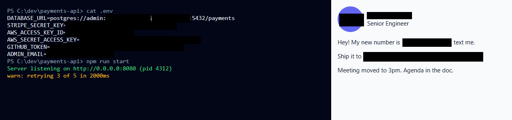

# 🕶️ Screenshot Auto-Redactor (Python / Gradio + MCP)

> This is the **server-side** version, with an HTTP API and an MCP tool for scripts and AI agents.
> The main, fully in-browser app is in [`../web`](../web), and a live demo runs at
> **[huggingface.co/spaces/screenshot-redactor/pii-privacy-redaction](https://huggingface.co/spaces/screenshot-redactor/pii-privacy-redaction)**.
> Built by [Parag Sawant (@paragpsawant)](https://github.com/paragpsawant).

**Share screenshots without leaking secrets.** Drop in a screenshot and it finds and covers
API keys, passwords, emails, phone numbers, card numbers, SSNs, IPs, names, addresses, faces
and QR codes. Review every box, untick false positives, and download a clean PNG with all
metadata stripped.

**Before**


**After** (one click, no manual boxes)



*All data in these images is fake.*

## What it detects

| Category | Examples | How |
|---|---|---|
| Secrets | OpenAI/Anthropic, AWS, GitHub, Stripe, Slack, Google, Hugging Face keys, JWTs, bearer tokens, `PASSWORD=…`, passwords in DB URLs, private-key headers, unlabeled high-entropy tokens | Rules + entropy |
| Contact | Emails, phone numbers (US + international) | Rules |
| Financial | Credit cards (Luhn-checked), IBANs (mod-97), bank/routing numbers, crypto wallets | Rules + checksums |
| Government IDs | US SSNs, passport and driver-license numbers | Rules + AI |
| Network | IPv4, IPv6, MAC addresses | Rules + parsing |
| People & places | Names, street addresses, dates of birth | GLiNER PII model (zero-shot NER) |
| Faces | Profile photos, webcam tiles | YuNet (bundled) |
| Codes | QR codes, barcodes | OpenCV |
| Custom | Your own words (company, project, hostname) | Exact match |

## How it works

```
screenshot ─► OCR (RapidOCR / PP-OCR, word boxes) ─► rules + checksums ─┐
                                                 └─► GLiNER PII NER ────┼─► char spans → pixel polygons ─► review ─► black box / pixelate / blur ─► PNG (no metadata)
          ─► YuNet faces ─► OpenCV QR/barcodes ─────────────────────────┘
```

Character spans are mapped back to pixels through each OCR word's box, so only the value is
covered — `OPENAI_API_KEY=` stays readable, the key does not.

> ⚠️ **Blur and pixelation are not secure for text.** They're offered for faces and aesthetics;
> use *black box* for anything secret.

## Use it from code or an AI agent (MCP)

Every Space running this app is also an **MCP server** exposing one tool, `redact_screenshot`.

```python
from gradio_client import Client, handle_file

client = Client("<your-hf-username>/<your-gradio-space>")  # after deploying python/ as a Gradio Space
image_path, report = client.predict(
    handle_file("screenshot.png"),
    ["secrets", "contact", "financial", "government_id", "network", "person", "location", "dates", "faces", "codes"],
    "black box",          # or "pixelate" / "blur"
    "Contoso, Falcon",    # extra words to hide
    True,                 # use AI for names/addresses
    api_name="/redact_screenshot",
)
```

MCP clients: add this Space's `/gradio_api/mcp/` endpoint.

## Run locally

```bash
pip install -r requirements.txt
python app.py            # http://127.0.0.1:7860
pytest -q                # REDACTOR_TEST_NER=1 to include the AI model
```

## Privacy

Images are processed in memory. Gradio's temporary upload cache is purged every 30 minutes.
Nothing is logged or stored. For fully private use, run it locally.

## Limitations

- Only text the OCR can read gets redacted: very small, blurry, or stylised text can be missed. Always review.
- Names and addresses come from an AI model and can be missed or over-flagged; untick false positives.
- Handwriting and non-Latin scripts have lower recall.

## License

Apache-2.0. The bundled YuNet face model is MIT-licensed (see `redactor/models/YUNET_LICENSE`).
