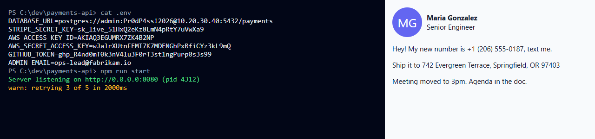
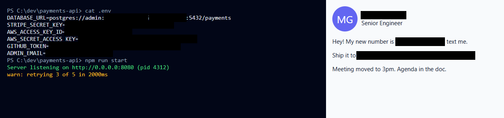

# 🕶️ Screenshot Redactor

**Hide secrets and personal info before you share a screenshot. Runs 100% in your browser.**

Paste a screenshot (Ctrl+V), drop it in, or pick a file. It finds and covers API keys, passwords,
emails, phone numbers, card numbers, SSNs, IPs, names, addresses, faces and QR codes. Review every
box, untick false positives, **drag to hide anything that was missed**, then download or copy a clean PNG.

- 🔒 **Nothing is uploaded.** All AI models run on your device via WebAssembly. The page's
  Content-Security-Policy blocks requests to any other server, so this is enforced, not promised.
- 📴 **Works offline** after the first load (~50 MB of models, cached by your browser).
- 🧹 **No metadata.** The PNG is re-encoded from pixels, so EXIF/GPS data is dropped.

**Before → after** (all data is fake):




## What it detects

| Category | Examples | How |
|---|---|---|
| Secrets | OpenAI/Anthropic, AWS, GitHub, Stripe, Slack, Google, Hugging Face keys, JWTs, bearer tokens, `PASSWORD=…`, passwords in DB URLs, private-key headers, unlabeled high-entropy tokens | Rules + entropy |
| Contact | Emails, phone numbers (US + international) | Rules |
| Financial | Credit cards (Luhn-checked), IBANs (mod-97), bank/routing numbers, crypto wallets | Rules + checksums |
| Government IDs | US SSNs, passport and driver-license numbers | Rules + AI |
| Network | IPv4, IPv6, MAC addresses | Rules + parsing |
| People & places | Names, street addresses (incl. ZIP) | On-device PII model (bert-small-pii, 28 MB) |
| Faces | Profile photos, webcam tiles | YuNet |
| Codes | QR codes, barcodes | Browser BarcodeDetector, or bundled jsQR |
| Custom | Your own words (company, project, hostname) | Exact match |

## How it works

```
screenshot ─► PP-OCRv6 text detection + recognition (ONNX Runtime Web, in a Web Worker)
           ├─► secret/PII rules + checksums ─┐
           ├─► PII token classifier ─────────┼─► character spans → pixel boxes ─► review / edit ─► PNG
           ├─► YuNet faces ──────────────────┤
           └─► QR / barcode detector ────────┘
```

Each character's position comes from the OCR model's CTC timesteps, so only the value is covered:
`OPENAI_API_KEY=` stays readable, the key does not.

> ⚠️ Blur and pixelation can sometimes be reversed for text. Use **black box** for anything secret.

## Limitations

- Only text the OCR can read is found automatically: tiny, blurry or stylised text can be missed. Review, and drag boxes over anything left.
- Name/address detection is an AI model; untick false positives. It is tuned for English.

## Credits & licenses

PP-OCRv6 via RapidOCR (Apache-2.0) · YuNet (MIT) · bert-small-pii-detection (Apache-2.0) ·
ONNX Runtime Web (MIT) · transformers.js (Apache-2.0) · jsQR (Apache-2.0). License texts are in
`vendor/LICENSES/` and `models/LICENSES/`; model sources and checksums are in `models/README.md`.
